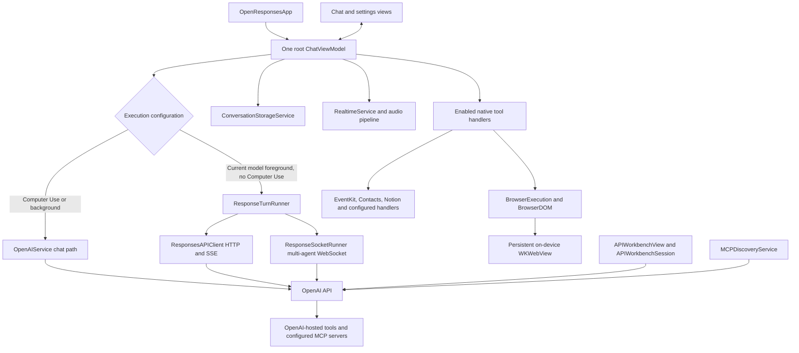

# OpenResponses system architecture

**Current source:** September 8, 2026, v2.6/build 39. The [2.6 technical change record](docs/releases/v2.6/TechnicalChanges.md) is the detailed service/contract reference; the [source inventory](docs/releases/v2.6/SourceInventory.md) identifies the exact implementation snapshot.

## App ownership and execution

SwiftUI views observe a single root `ChatViewModel` supplied by the app. The view model owns conversation selection, prompt settings, response presentation, cancellation and user decisions. Services isolate API transport, tool execution, browser state, audio, storage and system integrations.

Computer Use/background routing and Workbench are intentionally represented separately: a raw API template does not prove a native handler exists for every advertised tool. Native execution checks enabled tools, constrains concurrency and retains real results. Multi-agent tool injection waits for acknowledgement and terminal response state. Details and defaults are in the technical record.

## State and persistence

Conversation messages have stable identities. Stream buffers and delayed callbacks belong to a conversation/generation; switching or deleting chats cancels and flushes the outgoing owner before changing storage state. Compaction preserves complete returned context, and deletion invalidates incompatible raw/remote continuation state.

Local conversations are JSON files. Storage coalesces saves on a 750 ms checkpoint, uses immutable snapshots, serial background encoding and atomic writes, and reuses unchanged encoded images. Response completion and app backgrounding flush pending state. A storage error is presented without recursively generating another message/save.

Remote response/conversation storage is optional and distinct from these files. Remote hydration retrieves IDs known to the device, with separate metadata and paginated items; it is not account-wide enumeration.

MCP accounts use a versioned, atomic device-only Keychain archive. Prompts store selected account IDs; account metadata published to SwiftUI excludes secrets. Native OAuth, rotation and endpoint-bound credential refresh are described in [MCP connections](docs/mcp-connections.md).

Workbench draft text and selector state use their own debounced Keychain store. The literal JSON editor disables smart punctuation, and invalid schemas fail before any network transport starts.

## Models and settings

`CurrentModelCatalog` provides the recommended Astra/Sol/Terra/Luna group and current image/voice defaults. `ResponseSettingsRegistry` and modern options share saved configuration with the UI. Model compatibility shapes the outgoing payload; catalog membership does not confer account access. Missing modern fields in old presets decode with defaults.

## Browser, voice and files

The browser is a persistent offscreen WKWebView on the device. DOM and screenshot actions share one queue, callback/navigation identity, cancellation, timeouts and per-turn limits. Isolated snapshot refs prevent stale page targets from being treated as current. API safety decisions belong to the initiating turn. The browser does not require a separate local-network bridge and does not share Safari tabs.

Realtime voice uses a secure WebSocket and current nested audio/session configuration. Capture is converted to the expected PCM format; playback completion and session generations prevent stale speaking state from blocking continued listening. Mute, VAD interruption and route recovery belong to the active audio session.

Files and vector-store indexing have separate upload/readiness state. Batch exports download complete files to disk. Fine-tuning imports validated reviewed text-chat datasets and remains account-dependent. Resource pagination rejects malformed continuation instead of presenting incomplete data as a complete list.

## Data boundaries

API credentials persist through the iOS Keychain `SecItem` generic-password APIs. They are read into memory and transmitted to the relevant provider for authentication. Keychain storage is not a claim that a plaintext API token is a Secure Enclave cryptographic key.

Requested prompts, attachments, audio and tool results are transmitted to the configured services. OpenAI-hosted MCP may receive server credentials and connect to that server. Browser pages communicate with their website origins; relevant screenshots/page content can become model input. Local-first storage does not mean inference and hosted tools run entirely offline.

Demo Mode and first-live-send consent remain. Settings reset restores the active prompt defaults; it is not a universal erasure of keys, chat files, remote objects or website data. See [privacy](PRIVACY.md), [security](SECURITY.md) and the technical record for scope.

## Code entry points

| Boundary | Source |
| --- | --- |
| Root state | [OpenResponsesApp](OpenResponses/App/OpenResponsesApp.swift), [ChatViewModel](OpenResponses/Features/Chat/ViewModels/ChatViewModel.swift) |
| Native response execution | [ResponseTurnRunner](OpenResponses/Core/Services/ResponseTurnRunner.swift), [ResponseSocketRunner](OpenResponses/Core/Services/ResponseSocketRunner.swift) |
| Transport and Workbench | [ResponsesAPIClient](OpenResponses/Core/Services/ResponsesAPIClient.swift), [APIWorkbenchSession](OpenResponses/Core/Services/APIWorkbenchSession.swift) |
| Legacy/current shared chat service | [OpenAIService](OpenResponses/Core/Services/OpenAIService.swift) |
| Browser | [BrowserExecution](OpenResponses/Core/Services/BrowserExecution.swift), [BrowserDOM](OpenResponses/Core/Services/BrowserDOM.swift), [ComputerService](OpenResponses/Core/Services/ComputerService.swift) |
| MCP | [MCPDiscoveryService](OpenResponses/Core/Services/MCPDiscoveryService.swift), [MCPDiscoveryStream](OpenResponses/Core/Services/MCPDiscoveryStream.swift) |
| Audio | [RealtimeService](OpenResponses/Core/Services/RealtimeService.swift), [RealtimeAudioPipeline](OpenResponses/Core/Services/RealtimeAudioPipeline.swift) |
| Persistence | [ConversationStorageService](OpenResponses/Core/Services/ConversationStorageService.swift) |
| File readiness / pagination | [VectorStoreIndexing](OpenResponses/Core/Services/VectorStoreIndexing.swift), [ResourcePagination](OpenResponses/Core/Services/ResourcePagination.swift) |

## Verification and distribution

The September 8 implementation run passed 294 tests. GitHub CI now selects an available iPhone simulator, executes the unit/integration suite and retains its result bundle; this workflow change has not yet run in GitHub. ASC's retained successful archive belongs to older committed build 38, not the completed working tree. Use the [validation ledger](docs/releases/v2.6/Validation.md) and [ASC reconciliation](docs/releases/v2.6/ASCStatus.md) to distinguish these results.
