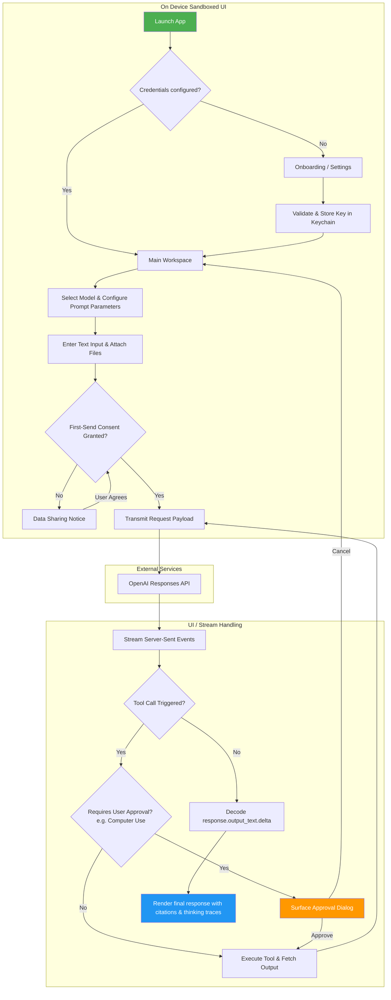
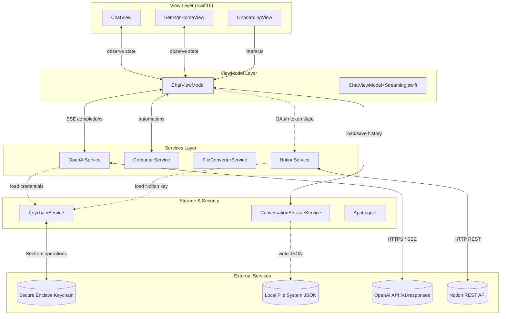
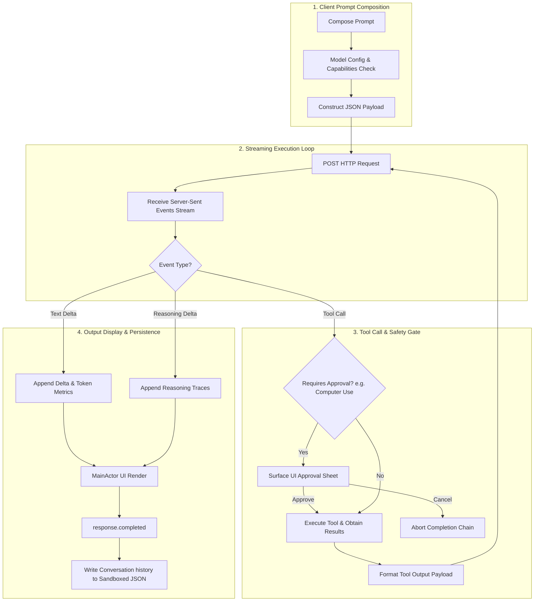
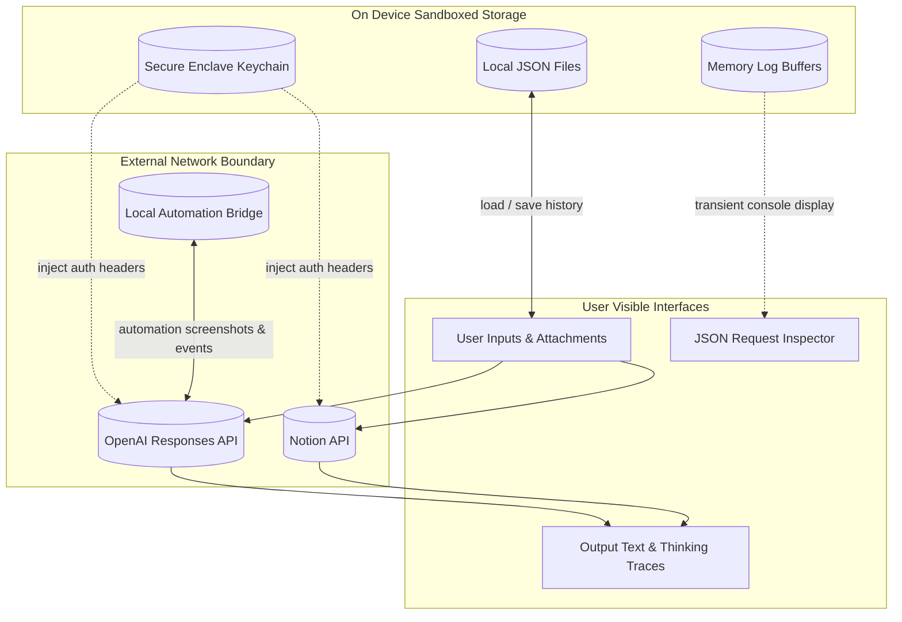

# OpenResponses
<p align="center">
  <!-- App icon or screenshot if available -->
</p>
<p align="center">
  <strong>SwiftUI developer client and playground for the OpenAI Responses API.</strong>
</p>
<p align="center">
  
  
  
  
</p>

## Overview

OpenResponses is a native iOS and macOS (Catalyst) client and playground built to interface directly with the OpenAI Responses API. It serves developers, prompt engineers, and AI systems designers as a high-fidelity workspace for prototyping model inputs and testing integrations.

- **What it is:** A native mobile application that exposes fine-grained parameters and tools of OpenAI's latest models, bypassing web interfaces to give developers direct API control.
- **Who it is for:** AI engineers and developers seeking mobile-first playground tools, local browser automation, and token-level connection debugging.
- **What problem it solves:** Obscurity in AI execution. Most clients hide system-sent events, thinking processes, and exact JSON payloads. OpenResponses provides token counters, activity feeds, expandable reasoning logs, and request JSON inspectors.
- **Why it is technically interesting:** It implements high-velocity Server-Sent Events (SSE) decoding using Swift Concurrency, local OCR image conversion pipelines, and sandboxed browser automation directly inside an iOS environment.
- **portfolio Alignment:** Unlike other repositories in this portfolio (such as the archived **OpenAssistant** which caches the state of the thread/run cycle of the Assistants API), OpenResponses connects directly to the Responses API, ensuring low-latency, stateless completions, and client-side tool orchestration.

---

## Product Snapshot

| Dimension | Detail |
| :--- | :--- |
| **Platform** | iOS 17.0+ / iPadOS 17.0+ / macOS Catalyst |
| **Language** | Swift 5.10+ |
| **UI** | SwiftUI |
| **Architecture** | MVVM-S (Model-View-ViewModel-Service) |
| **Primary APIs** | OpenAI Responses API, Notion API, native Apple frameworks (EventKit, Contacts) |
| **Storage** | Keychain (credentials Enclave), Sandboxed local JSON files (conversations list) |
| **Status** | Phase 1 Completed / Phase 2 (Remote Conversations API) In Progress |
| **App Store** | Not published |
| **License** | [MIT License](LICENSE) |

---

## What This App Demonstrates

- **Direct Network Boundary:** Communicates client-to-endpoint over secure HTTPS, bypassing middle-tier proxies to guarantee privacy.
- **High-Velocity Concurrency:** SSE streaming utilizing Swift Concurrency (`AsyncThrowingStream`), dispatching mutations safely to the Main Actor to maintain main-thread scrolling.
- **Security-Conscious Storage:** Saves all secrets and integration tokens inside the secure iOS Keychain Enclave, with automated migrations for legacy settings.
- **Sandboxed Browser Automation:** Runs WKWebView automation ("Computer Use") with layout reload coordinators, scroll/click suppressors, and explicit UI safety approvals.
- **Local File Conversion Pipeline:** On-device extraction of 43 distinct file extensions (including PDFs and vision OCR images) prior to request packaging.
- **Deep Observability UI:** Visual token metric widgets, inline expandable thinking trace panels, and live request inspectors displaying raw JSON payloads.

---

## End-to-End User Journey

This flow shows how the user navigates from initial onboarding to sending prompts and handling background tool loops:



---

## System Architecture

The application isolates views from API and device frameworks using the MVVM-S system pattern:



---

## Core Pipeline

The core execution loop of a chat request, from composition and model checks to streaming and tool approval gates:



---

## Data Flow

OpenResponses enforces clear boundaries between on-device sandboxed databases, Keychain secrets, and third-party API payloads:



---

## Ingestion / Processing / Retrieval Details

### Ingestion
OpenResponses accepts natural language text inputs and file attachments. Attachments can be selected via the iOS Document Picker or Photo Library.

### Processing
When a file is imported:
- [FileConverterService](OpenResponses/Core/Services/FileConverterService.swift) evaluates the file format (supporting 43 distinct file extensions).
- Multi-page PDFs are decoded using `PDFKit` to extract text layouts.
- Image assets (PNG, JPEG) are parsed using Apple's native `Vision` OCR framework to recognize text content.
- Visual media and text segments are packed into request payloads according to OpenAI multi-modal standards.

### Retrieval / Querying
- **Web Search:** Toggled settings inject the `web_search` tool schema into the payload, instructing OpenAI's servers to query search indices and return structured citation objects.
- **Notion Integration:** The [NotionService](OpenResponses/Core/Services/NotionService.swift) executes queries against paired databases, fetching schema structures and writing page blocks.
- **Apple Providers:** Native Calendar, Contacts, and Reminders repositories interact with EventKit and Contacts frameworks to query local schedules and sync records with chat requests.

### Generation / Output
Completions stream using Server-Sent Events (SSE). The JSON stream decoder in [OpenAIService](OpenResponses/Core/Services/OpenAIService.swift) decodes lines (including `response.output_text.delta` and `response.output_item.delta`), emitting structured events. The UI updates the text timeline and displays collapsible reasoning tracing blocks. The Request Inspector extracts and renders exact JSON transactions.

---

## Key Technical Decisions

| Decision | Rationale | Tradeoff |
| :--- | :--- | :--- |
| **MVVM-S Pattern** | Decouples SwiftUI views from network logic and device frame interfaces. | Increases boilerplate code by introducing ViewModel interfaces. |
| **Enclave Keychain for Keys** | Secures API keys and OAuth tokens in the Secure Enclave, isolated from backups. | Requires users to enter keys manually on each newly configured device. |
| **Direct Client-to-API Network** | Guarantees complete data privacy and eliminates middleware server maintenance costs. | Restricts enterprise configuration controls. |
| **Main Actor SSE Dispatching** | Prevents concurrent write conflicts and race condition crashes on the conversation timeline. | Minor processing overhead from wrapping frequent stream deltas. |
| **WKWebView Coordinator URLs** | Prevents layout sweeps from triggering infinite WKWebView `.load()` reload loops. | Increases coordinator state management complexity. |

---

## File Entry Points

| Concern | Files | Responsibility |
| :--- | :--- | :--- |
| **App Entry** | [OpenResponsesApp.swift](OpenResponses/App/OpenResponsesApp.swift) | Bootstrapping dependencies and executing Keychain migrations. |
| **App Container** | [AppContainer.swift](OpenResponses/App/AppContainer.swift) | Service locator and dependency injection container. |
| **Main UI Shell** | [ContentView.swift](OpenResponses/App/ContentView.swift) | Primary tab view and navigation shell. |
| **Chat Interface** | [ChatView.swift](OpenResponses/Features/Chat/ChatView.swift) | Chat rendering, activity logs, and text input fields. |
| **View Orchestration** | [ChatViewModel.swift](OpenResponses/Features/Chat/ChatViewModel.swift) | Session state management, configurations, and tool approvals. |
| **OpenAI Service** | [OpenAIService.swift](OpenResponses/Core/Services/OpenAIService.swift) | Request payload construction and SSE stream parsing. |
| **Keychain Helper** | [KeychainService.swift](OpenResponses/Core/Services/KeychainService.swift) | Secure token persistence and deletion. |
| **Browser Automation** | [ComputerService.swift](OpenResponses/Core/Services/ComputerService.swift) | WKWebView action loops, safety gates, and screen captures. |
| **File Extraction** | [FileConverterService.swift](OpenResponses/Core/Services/FileConverterService.swift) | Local parsing and OCR processing of attachments. |
| **Notion Integration** | [NotionService.swift](OpenResponses/Core/Services/NotionService.swift) | Notion workspace query and write integrations. |

---

## Configuration Catalog

The configuration parameters are defined inside the `Prompt` model. They map to `UserDefaults` keys (for preferences) or the secure iOS Keychain (for credentials).

| Setting | Storage | Default | Required | Purpose |
| :--- | :--- | :--- | :--- | :--- |
| **OpenAI API Key** | Keychain (`openAIKey`) | None | **Yes** | Authenticates all OpenAI completions and tool queries. |
| **Notion Token** | Keychain (`notionApiKey`) | None | No | Authenticates Notion integration queries. |
| **Model Selection** | `UserDefaults` (`Prompt.model`) | `gpt-5.5` | **Yes** | Active chat completions model (e.g. `gpt-4o`, `o3-mini`). |
| **Reasoning Effort** | `UserDefaults` | `medium` | No | Effort configuration for reasoning models (`low`, `medium`, `high`). |
| **Web Search** | `UserDefaults` | `true` | No | Toggles OpenAI web search capabilities. |
| **Code Interpreter** | `UserDefaults` | `true` | No | Toggles OpenAI sandboxed Python executions. |
| **Computer Use** | `UserDefaults` | `false` | No | Toggles browser automation loop. |
| **Notion Integration** | `UserDefaults` | `true` | No | Toggles Notion tool database access. |
| **Apple Integrations** | `UserDefaults` | `true` | No | Toggles local Calendar, Reminders, and Contacts access. |

---

## Getting Started

### Local Setup
1. **Clone the Repository:**
   ```bash
   git clone https://github.com/Gunnarguy/OpenResponses.git
   cd OpenResponses
   ```

2. **Open in Xcode:**
   ```bash
   open OpenResponses.xcodeproj
   ```

3. **Requirements:**
   - Xcode 16.1 or newer.
   - iOS 17.0+ deployment target.
   - Active OpenAI API key.

4. **Scheme Environment Variables:**
   Under Xcode `Product > Scheme > Edit Scheme... > Arguments`, add:
   - `OPENAI_API_KEY`: Testing credential.
   - `NOTION_API_KEY`: Notion developer credentials (optional).

---

## Testing and QA

| Validation | Command / Procedure | Expected Result |
| :--- | :--- | :--- |
| **Build Project** | Build project in Xcode (`Cmd+B`) or run `xcodebuild build` | Compilation completes with zero error signals. |
| **Unit Tests** | `xcodebuild test -project OpenResponses.xcodeproj -scheme OpenResponses -destination 'platform=iOS Simulator,name=iPhone 16 Pro'` | All unit test suites pass successfully. |
| **Secret Scan** | `python3 scripts/secret_scan.py` | Command returns success with zero hardcoded secrets. |
| **Preflight Checks** | `bash scripts/preflight_check.sh` | Success output for builds and info.plist structures. |
| **Manual QA** | Run app, enter credentials (or Explore Demo), execute a prompt. | Streaming deltas rendering with reasoning tracing cards. |

---

## Privacy and Security

OpenResponses operates under a local-first threat model:
- **Zero Remote Middleware:** Requests are sent directly from the device over HTTPS.
- **Secure Keychain Storage:** Storing API keys in the Secure Enclave.
- **Opt-In Safety Notice:** Requires explicit user confirmation prior to sending the first network completions payload.

For details, refer to [SECURITY.md](SECURITY.md) and [PRIVACY.md](PRIVACY.md).

---

## Documentation Index

| Document | Purpose |
| :--- | :--- |
| [README.md](README.md) | Central entry point and architecture walkthrough. |
| [ARCHITECTURE.md](ARCHITECTURE.md) | Deep system architecture breakdown, concurrency, and APIs. |
| [ROADMAP.md](ROADMAP.md) | Phased project progression and archived legacy client timeline. |
| [SECURITY.md](SECURITY.md) | Secure Enclave details, local data risks, and pre-commit checks. |
| [PRIVACY.md](PRIVACY.md) | Data handling disclosures, permission gates, and deletion guides. |
| [APP_STORE.md](APP_STORE.md) | Metadata copy listings and reviewer testing walkthroughs. |
| [docs/CASE_STUDY.md](docs/CASE_STUDY.md) | Case study of production milestones and engineering solutions. |
| [CONTRIBUTING.md](CONTRIBUTING.md) | Local development, styling standards, and agent guidelines. |

---

## License

OpenResponses is released under the [MIT License](LICENSE).
