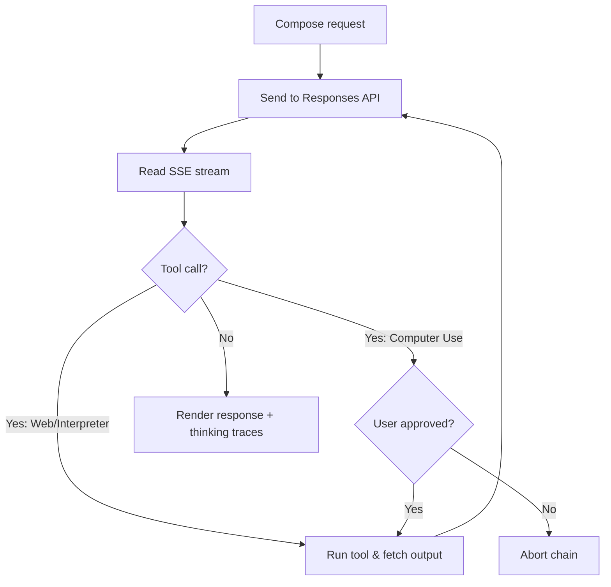
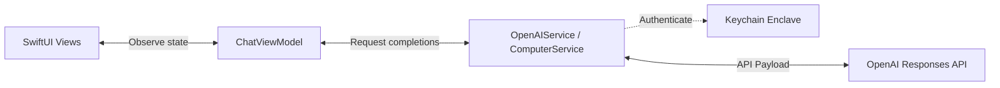
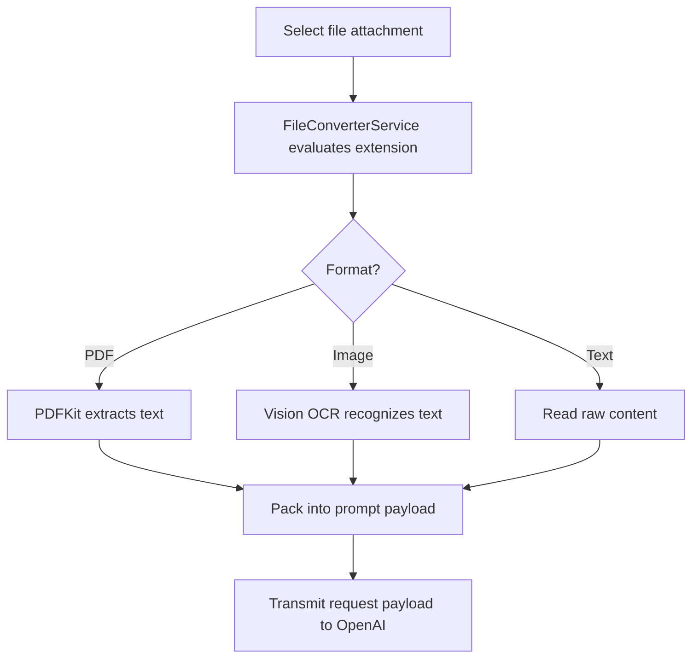
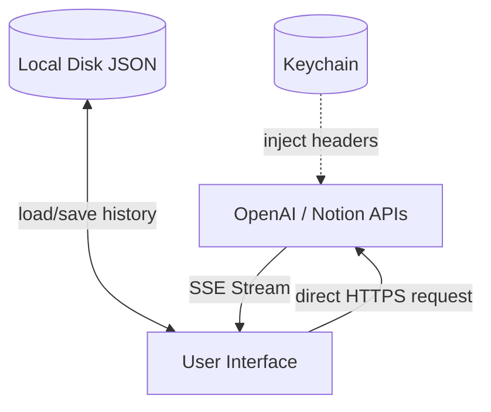

# OpenResponses

<p align="center">
  
</p>

<p align="center">
  <strong>SwiftUI developer client for the OpenAI Responses API and the successor to OpenAssistant.</strong>
</p>

<p align="center">
  <a href="https://apps.apple.com/us/app/openresponses/id6757338355">
    
  </a>
  
  
  
</p>

## Overview

OpenResponses is a native SwiftUI Playground for OpenAI Responses API. It functions as a mobile developer playground and testing workspace, exposing low-level model parameters, tool execution, token-level streaming data, and raw request visibility without hiding the API behind a custom proxy layer.

* **Target Audience:** AI engineers, prompt designers, and developers needing direct client-to-API control.
* **Core Problem Solved:** Lack of visibility in standard AI interfaces. OpenResponses exposes raw token counters, network statuses, expandable reasoning traces for o1/o3-mini, and outbound/inbound JSON payloads.
* **Technical Characteristics:** Direct client-to-endpoint connections, local document parsing (with Vision OCR), and sandboxed browser automation loops.
* **Feature Tiers:** 
  * **Core Playground**: Responses API (Chat, Tool Calling, Vision, Models)
  * **Developer Lab**: Batch API, Fine-Tuning
  * **Legacy Migration**: Assistants API
* **Product Lineage:** OpenResponses is the active evolution of Gunnar Hostetler's API-tooling work and supersedes the older OpenAssistant Assistants API client.

---

## Product Snapshot

| Dimension | Detail |
|---|---|
| Platform | iOS / iPadOS / macOS Catalyst |
| Language | Swift |
| UI | SwiftUI |
| Architecture | MVVM-S |
| Primary APIs | OpenAI Responses API, Notion API, EventKit, Contacts |
| Storage | Keychain, sandboxed JSON files |
| App Store | [Download](https://apps.apple.com/us/app/openresponses/id6757338355) |
| Status | Active |
| License | [MIT](LICENSE) |

---

## Key Capabilities

* **Direct API Connections:** Outbound HTTPS traffic routes directly from the iOS client to OpenAI and Notion endpoints without intermediate proxy servers.
* **Asynchronous SSE Streaming:** Uses Swift Concurrency (`AsyncThrowingStream`) to parse Server-Sent Events line-by-line, dispatching UI updates to the `@MainActor` to avoid layout race conditions.
* **Realtime Voice WebSockets:** Includes a premium Voice Mode leveraging `wss://` for bi-directional 24kHz PCM16 audio streaming (Direct BYOK WebSocket mode).
* **Legacy Assistants:** Seamlessly toggle between stateless Responses and stateful Assistants thread runs for long-form context migration.
* **Developer Labs:** Full in-app integration for generating JSONL datasets, submitting asynchronous Batch API runs, and scheduling Fine-Tuning jobs directly from local chat history.
* **Secure Keychain Storage:** API keys, Notion tokens, and custom Model Context Protocol (MCP) headers are stored inside the secure iOS Keychain. Plaintext keys are never written to `UserDefaults` or standard logs.
* **Sandboxed Browser Automation:** Runs WKWebView browser execution ("Computer Use") using state coordinators to prevent layout reload loops, gated by step-by-step UI approvals.
* **Local Ingestion & OCR:** Extracts text from PDFs using `PDFKit` and recognizes text in image attachments using the native `Vision` OCR framework locally on-device.
* **Observability Tools:** Includes inline collapsible reasoning panels, live connection monitors, and a Request Inspector rendering raw JSON payloads.

---

## How It Works

The following flowchart outlines the request lifecycle, tool branches, and approval gates:



---

## Architecture

The codebase separates views from network and system frameworks using the MVVM-S pattern:



*For a detailed layer-by-layer system map and data flow boundaries, see [ARCHITECTURE.md](ARCHITECTURE.md).*

---

## Core Workflows

The local file conversion and ingestion workflow converts attachments prior to payload transmission:



---

## Data Flow

Data boundaries separate on-device storage, Keychain secrets, and third-party APIs:



---

## File Entry Points

| Concern | Files | Responsibility |
| :--- | :--- | :--- |
| **App Entry** | [OpenResponsesApp.swift](OpenResponses/App/OpenResponsesApp.swift) | Initial bootstrapping and startup migrations. |
| **DI Container** | [AppContainer.swift](OpenResponses/App/AppContainer.swift) | Service locator for dependency injection. |
| **Main UI** | [ContentView.swift](OpenResponses/App/ContentView.swift) | Navigation shell and tab container. |
| **Chat View** | [ChatView.swift](OpenResponses/Features/Chat/ChatView.swift) | Chat rendering and text/attachment inputs. |
| **Chat ViewModel** | [ChatViewModel.swift](OpenResponses/Features/Chat/ChatViewModel.swift) | Session state management, settings, and tool approvals. |
| **OpenAI Client** | [OpenAIService.swift](OpenResponses/Core/Services/OpenAIService.swift) | Payload assembly and SSE stream parsing. |
| **Keychain Storage** | [KeychainService.swift](OpenResponses/Core/Services/KeychainService.swift) | Secure credentials management. |
| **Browser Automation** | [ComputerService.swift](OpenResponses/Core/Services/ComputerService.swift) | Sandboxed browser automation and capture loops. |
| **File Extraction** | [FileConverterService.swift](OpenResponses/Core/Services/FileConverterService.swift) | On-device file conversions and OCR text recognition. |
| **Notion Client** | [NotionService.swift](OpenResponses/Core/Services/NotionService.swift) | Direct Notion workspace database integrations. |

---

## Configuration

The configurations map to `UserDefaults` (for preferences) or the secure Keychain (for keys).

| Setting | Storage | Default | Required | Purpose |
| :--- | :--- | :--- | :--- | :--- |
| **OpenAI API Key** | Keychain (`openAIKey`) | None | **Yes** | Authenticates all OpenAI network requests. |
| **Notion Token** | Keychain (`notionApiKey`) | None | No | Authenticates Notion integration requests. |
| **Model Selection** | `UserDefaults` | `gpt-5.5` | **Yes** | Target completions model (e.g. `gpt-4o`, `o3-mini`). |
| **Reasoning Effort** | `UserDefaults` | `medium` | No | Configures reasoning constraints (`low`, `medium`, `high`). |
| **Web Search** | `UserDefaults` | `true` | No | Toggles OpenAI web search capabilities. |
| **Code Interpreter** | `UserDefaults` | `true` | No | Toggles OpenAI sandboxed Python containers. |
| **Computer Use** | `UserDefaults` | `false` | No | Toggles local browser automation tool. |
| **Notion Integration** | `UserDefaults` | `true` | No | Toggles Notion tool access. |
| **Apple Integrations** | `UserDefaults` | `true` | No | Toggles Calendar, Reminders, and Contacts access. |

---

## v2.6 Release Freeze

The v2.6 release finalizes OpenResponses as a native iOS Playground for the OpenAI Responses API. We have frozen the feature scope to ensure high quality and clarity around the app's purpose.

**What is Done:**
* Model selection, prompt controls, tool configuration, streaming, Computer Use, MCP, request inspection, files/images, and developer lab utilities.
* Transitioned Assistants API into a legacy migration lab.
* Native Chat-Native Computer Use Tool Execution Cards.
* Standardized Realtime Voice GA endpoints.

**What is Intentionally Not Done:**
* Deep Lifecycle Completeness (e.g. Conversations CRUD, `compact`, explicit cancel).
* Strict Parameter/Gating Hardening (preventing invalid combinations before API hit).
* Exhaustive Debug Utilities for missing tools/features.
* Full parity for every endpoint listed in the OpenAI API documentation.

**Settings Coverage Matrix**
The following prompt options are fully exposed and supported via the `ResponseSettingsRegistry`:

| Field | API Key | Group | Default | Description |
|---|---|---|---|---|
| Preset Name | `name` | Hidden | `Default` | The name of this preset. |
| Model | `model` | Model | `gpt-4o` | The OpenAI model to use for this request. |
| Reasoning Effort | `reasoning_effort` | Reasoning | `medium` | How much effort the model should spend reasoning. |
| Reasoning Summary | `reasoningSummary` | Reasoning | `auto` | How the reasoning process is summarized. |
| Temperature | `temperature` | Model | `1.0` | Controls randomness. |
| System Instructions | `messages` | Instructions | `You are a helpful assistant.` | Top-level instructions defining the assistant's behavior. |
| Developer Instructions | `messages` | Instructions | *None* | Override developer-level instructions. |
| Web Search | `tools` | Tools | `true` | Enables OpenAI web search tool. |
| File Search | `tools` | Tools | `true` | Enables OpenAI file search tool. |
| Code Interpreter | `tools` | Tools | `true` | Enables OpenAI code interpreter tool. |
| Computer Use | `tools` | Tools | `false` | Enables local browser automation. |
| Max Output Tokens | `max_completion_tokens` | Limits | *None* | Limit on the maximum tokens generated. |

---

## Build & Run

### Local Setup
1. **Clone the Repository:**
   ```bash
   git clone https://github.com/Gunnarguy/OpenResponses.git
   cd OpenResponses
   ```

2. **Open in Xcode:**
   ```bash
   open OpenResponses.xcodeproj
   ```

3. **Requirements:**
   * Xcode 16.1 or newer.
   * iOS 17.0+ deployment target.
   * Active OpenAI API key.

4. **Xcode Scheme Variables:**
   Under Xcode `Product > Scheme > Edit Scheme... > Arguments`, add:
   - `OPENAI_API_KEY`: API credential.
   - `NOTION_API_KEY`: Notion token (optional).

---

## Testing

| Test Type | Command / Procedure | Expected Result |
| :--- | :--- | :--- |
| **Build Target** | Build project in Xcode (`Cmd+B`) | Compilation completes with no errors. |
| **Unit Tests** | `xcodebuild test -project OpenResponses.xcodeproj -scheme OpenResponses -destination 'platform=iOS Simulator,name=iPhone 16 Pro'` | All unit test suites pass successfully. |
| **Secret Scan** | `python3 scripts/secret_scan.py` | CLI tool returns success with no keys detected. |
| **Preflight check** | `bash scripts/preflight_check.sh` | Confirms Info.plist privacy descriptions are present. |

---

## Privacy & Security

OpenResponses operates under a local-first threat model:
* **Direct Network Boundaries:** All requests are sent directly from the device over HTTPS.
* **Keychain Storage:** Storing API keys securely in the iOS Keychain.
* **Opt-In Safety Notice:** Requires explicit user confirmation prior to sending the first completions payload.

For details, refer to [SECURITY.md](SECURITY.md) and [PRIVACY.md](PRIVACY.md).

---

## Documentation

| Document | Purpose |
|---|---|
| [Architecture](ARCHITECTURE.md) | System design, data flow, and service boundaries |
| [Security](SECURITY.md) | Secret handling, local storage, and release checks |
| [Privacy](PRIVACY.md) | Data storage, API transmission, and user controls |
| [Roadmap](ROADMAP.md) | Current status, planned work, and known gaps |
| [App Store Notes](APP_STORE.md) | App Store metadata, review notes, and release checklist |
| [Case Study](docs/CASE_STUDY.md) | Engineering retrospective and implementation notes |
| [Contributing](CONTRIBUTING.md) | Local development setup and contribution guidelines |

---

## Roadmap

### Phase 1: Core Playground & Tool Integrations (Completed)
- [x] **Model Selector Playground:** Dynamic sorting and capability gating for chat models from GPT-4o up to GPT-5.5.
- [x] **Streaming Observability:** Real-time Server-Sent Events (SSE) parsing with live token counters and request inspector panels.
- [x] **Collapsible Thinking UX:** Surfaces collapsible reasoning traces for o1/o3 models inline under dedicated cards.
- [x] **Local History:** On-device JSON conversation database with prompt preset libraries.
- [x] **Secure Enclave Storage:** Migration hooks moving keys from standard `UserDefaults` securely into the iOS Keychain.
- [x] **Code Interpreter:** Sandboxed Python executions rendering text logs and visual charts inline in chat view.
- [x] **Web Search:** Multi-source citation annotations parsing with page-crawl depths.
- [x] **Computer Use Harness:** Sandboxed local WKWebView automation loop (`computer` and legacy `computer_use_preview` tools) with step-by-step UI safety approval dialogs and scroll/click throttles.

### Phase 2: Remote Conversations & Rich Annotations (In Progress)
- [/] **Backend-Managed Conversations:** Integrate the `/v1/conversations` API methods to list, fetch, update, and delete remote threads.
- [ ] **Rich Citations Rendering:** Map inline URL and document citation markers into SwiftUI `AttributedString` bubbles.
- [ ] **Short Conversation Compaction:** Integrate `POST /v1/responses/compact` executions to compress long chats to fit context caps.
- [ ] **Structured JSON Outputs:** Add `response_format` JSON schema selection to prompt settings for strict data extractions.

### Phase 3: Developer Labs & Legacy Features
- [x] **Assistants API:** Stateful thread runs, assistant creation, and CRUD management (Legacy Migration).
- [x] **Realtime API:** Voice Mode with websocket connections, PCM16 audio (Direct BYOK WebSocket mode).
- [x] **Batch API:** File uploads, JSONL generation, and high-throughput background job monitoring (Developer Lab).
- [x] **Fine-Tuning API:** Creation of fine-tuning datasets from chat history and custom model training execution (Developer Lab).
- [x] **Moderation API:** Real-time input interception using `/v1/moderations` to ensure policy compliance before completions.

### Phase 4: Local Sandboxing & Advanced Integrations (Planned)
- [ ] **On-Device Python Execution:** Run local Python containers using Pyodide/WebAssembly to avoid remote sandboxes.
- [ ] **Model Context Protocol (MCP) Expansion:** Pair remote MCP servers with Keychain-stored custom auth headers.
- [ ] **On-Device Embedding Cache:** Cache vector embeddings locally to save token costs on recurring documents.

---

## License

OpenResponses is released under the [MIT License](LICENSE).
