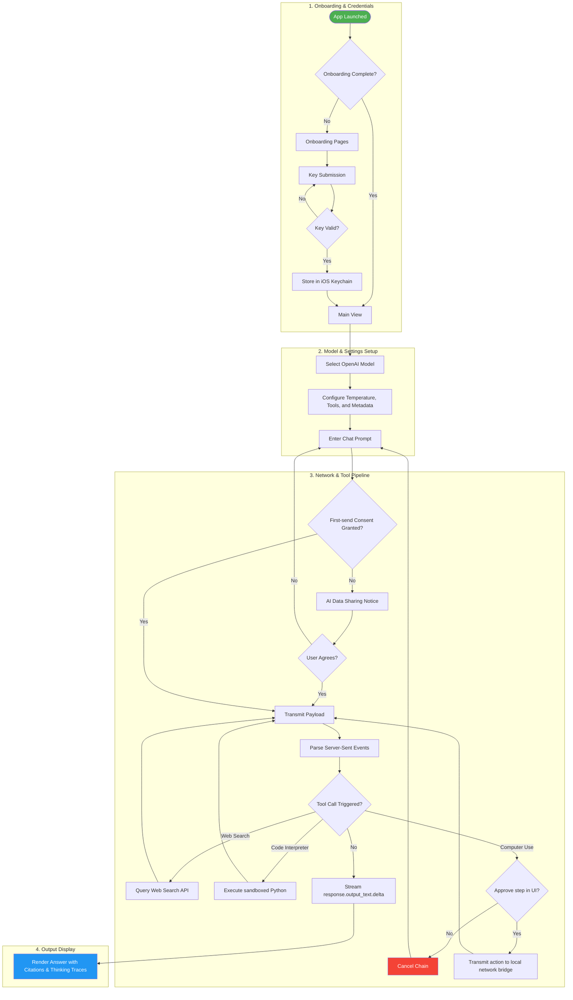
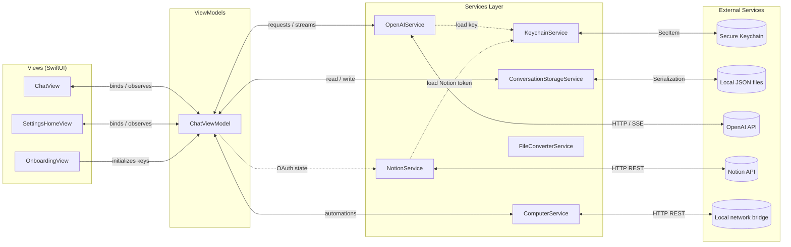
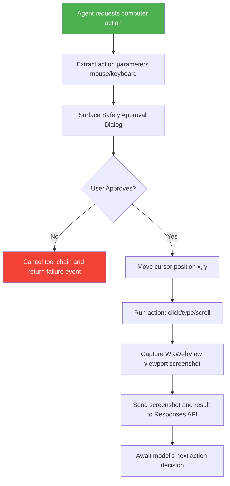
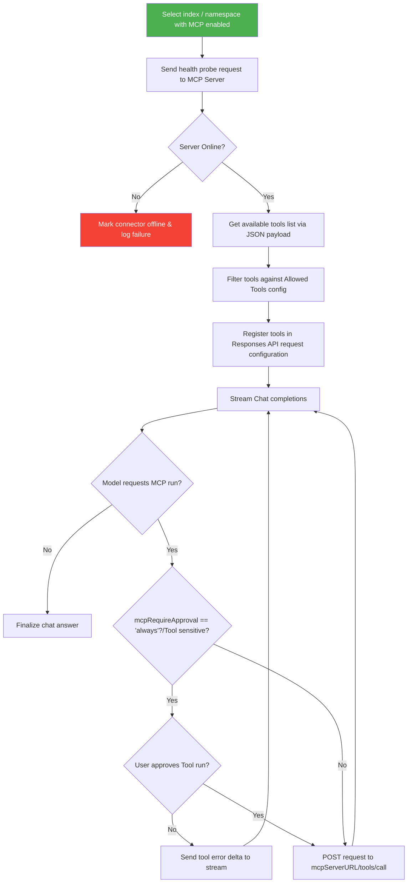

# OpenResponses

SwiftUI-powered AI assistant and developer playground for the OpenAI Responses API. Featuring local-first architecture, sandboxed Python code execution, browser automation, and secure Keychain storage, OpenResponses delivers deep API observability with production-grade safety rails.

[](https://github.com/Gunnarguy/OpenResponses/actions/workflows/ios-ci.yml)
[](https://github.com/Gunnarguy/OpenResponses/actions/workflows/release-check.yml)
[](LICENSE)

Last updated: 2026-05-29

---

## Table of Contents
- [Overview](#overview)
- [End-to-End User Journey](#end-to-end-user-journey)
- [System Architecture](#system-architecture)
- [Workflow Pipelines](#workflow-pipelines)
- [Configuration Catalog](#configuration-catalog)
- [Developer Onboarding](#developer-onboarding)
- [Documentation Index](#documentation-index)
- [License](#license)

---

## Overview

OpenResponses is a native iOS and macOS (Catalyst) client that interfaces directly with the OpenAI Responses API. It serves developers, prompt engineers, and technical creators as a mobile playground. Key characteristics include:
* **Direct Network Boundary:** OpenResponses establishes direct HTTPS connections to OpenAI. It does not run intermediary proxy servers.
* **Keychain Security:** API keys, Notion tokens, and MCP credentials reside strictly within the secure iOS Keychain.
* **Observe-in-Real-Time:** Displays token counts, activity indicators, expandable reasoning traces, and raw JSON payload structures for every query.

---

## End-to-End User Journey



---

## System Architecture

The application follows the **MVVM-S (Model-View-ViewModel-Service)** pattern to isolate UI components from connection logic:



---

## Workflow Pipelines

### Browser Automation / Computer Use Loop


### Model Context Protocol (MCP) Discovery & Execution


---

## Configuration Catalog

The configuration parameters are defined inside the `Prompt` model. They map to `UserDefaults` keys (persisted as JSON structures or preferences) or the secure iOS Keychain.

### 1. API Credentials & Auth
| Config Name | Storage Location | Default Value | Purpose |
| :--- | :--- | :--- | :--- |
| **OpenAI API Key** | Keychain (`openAIKey`) | None | Authenticates all OpenAI requests. |
| **Notion Token** | Keychain (`notionApiKey`) | None | Authenticates Notion integration queries. |
| **MCP Manual Headers** | Keychain (`mcp_manual_[label]`) | None | Custom headers payload (JSON) for custom MCP. |

### 2. Model & Execution Parameters
| Config Name | Storage Location | Default Value | Bounds / Ranges |
| :--- | :--- | :--- | :--- |
| **OpenAI Model** | `activePrompt` | `gpt-5.4` | List of allowed chat models. |
| **Reasoning Effort** | `activePrompt` | `medium` | `none`, `low`, `medium`, `high`, `max`. |
| **Temperature** | `activePrompt` | `1.0` | `0.0` to `2.0` (disabled for reasoning models). |
| **Top P** | `activePrompt` | `1.0` | `0.0` to `1.0` (nucleus sampling). |
| **Stream Responses** | `activePrompt` | `true` | Boolean. Enable Server-Sent Events (SSE). |
| **Store Responses** | `activePrompt` | `true` | Boolean. Keep history records on OpenAI servers. |
| **Prompt Cache Key** | `activePrompt` | `""` | String. Reuse cached context. |
| **Safety Identifier** | `activePrompt` | `""` | String. Abuse detection hashed tag. |
| **Tool Choice** | `activePrompt` | `auto` | `auto`, `required`, `none`. |
| **Parallel Tool Calls** | `activePrompt` | `true` | Boolean. Allow concurrent tool execution. |
| **Background Mode** | `activePrompt` | `false` | Boolean. Allows processing behind active UI. |
| **Max Tool Calls** | `activePrompt` | `0` (Disabled) | `1` to `32` (stepper constraint). |
| **Truncation Strategy** | `activePrompt` | `auto` | `auto` (automatic sliding window) or `disabled`. |

### 3. Enabled API Tools
| Config Name | Storage Location | Default Value | Description |
| :--- | :--- | :--- | :--- |
| **Web Search** | `activePrompt` | `true` | Toggle OpenAI search tool. |
| **Code Interpreter** | `activePrompt` | `true` | Toggle sandboxed Python container. |
| **Image Generation** | `activePrompt` | `true` | Toggle image production capabilities. |
| **File Search** | `activePrompt` | `false` | Toggle OpenAI vector stores search. |
| **Computer Use** | `activePrompt` | `false` | Toggle WKWebView automations. |
| **Notion Integration** | `activePrompt` | `true` | Toggle Notion tools payload registration. |
| **Apple Integrations** | `activePrompt` | `true` | Toggle Calendar, Reminders, and Contacts access. |

---

## Developer Onboarding

### Local Setup Walkthrough
1. **Clone the repository:**
   ```bash
   git clone https://github.com/Gunnarguy/OpenResponses.git
   cd OpenResponses
   ```
2. **Open in Xcode:**
   Open `OpenResponses.xcodeproj` in Xcode 16.1 or newer.
3. **Environment Setup (Xcode Schemes):**
   * Edit Scheme (`Product > Scheme > Edit Scheme...`).
   * Under **Arguments**, configure environment variables for debug runs:
     * `OPENAI_API_KEY`: Developer testing token.
     * `NOTION_API_KEY`: Notion developer key.

### CLI Setup scripts (VS Code config)
Run the helper script to configure VS Code extensions, lint setups, and build targets:
```bash
bash scripts/setup-pi-mcp.sh
```

---

## Documentation Index

| File | Description |
| :--- | :--- |
| [README.md](file:///Users/gunnarhostetler/Documents/GitHub/OpenResponses/README.md) | Central entry point and architecture walkthrough. |
| [ARCHITECTURE.md](file:///Users/gunnarhostetler/Documents/GitHub/OpenResponses/ARCHITECTURE.md) | Deep dive into MVVM-S patterns and API endpoints mappings. |
| [ROADMAP.md](file:///Users/gunnarhostetler/Documents/GitHub/OpenResponses/ROADMAP.md) | Phased project progression and OpenAssistant archive details. |
| [SECURITY.md](file:///Users/gunnarhostetler/Documents/GitHub/OpenResponses/SECURITY.md) | Details Keychain partitions, scan utilities, and build guards. |
| [PRIVACY.md](file:///Users/gunnarhostetler/Documents/GitHub/OpenResponses/PRIVACY.md) | Sandboxing bounds, data sharing notice, and opt-out tables. |
| [APP_STORE.md](file:///Users/gunnarhostetler/Documents/GitHub/OpenResponses/APP_STORE.md) | Promotional copy listings and reviewer testing walkthrough. |
| [docs/CASE_STUDY.md](file:///Users/gunnarhostetler/Documents/GitHub/OpenResponses/docs/CASE_STUDY.md) | Case study of production milestones and issues solved. |

---

## License

OpenResponses is released under the [MIT License](LICENSE).
