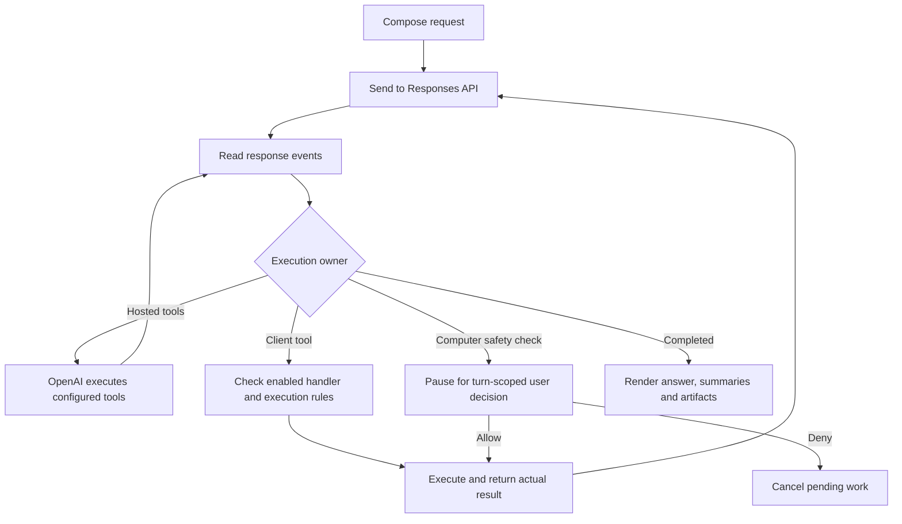
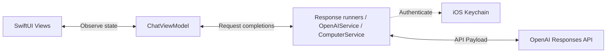
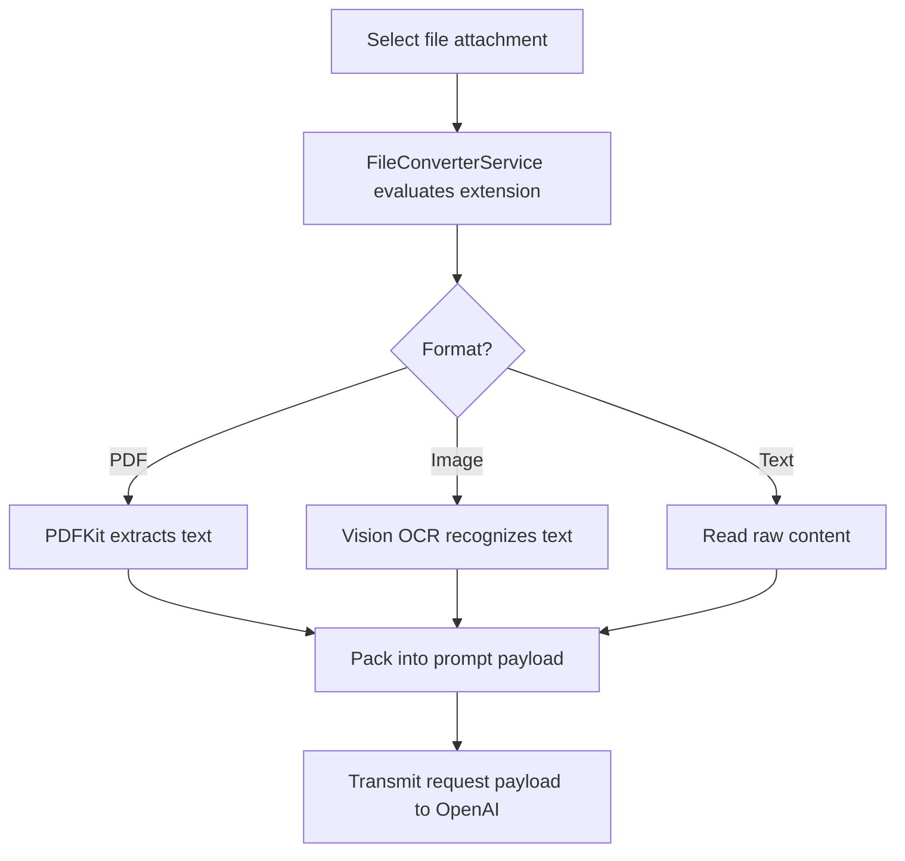
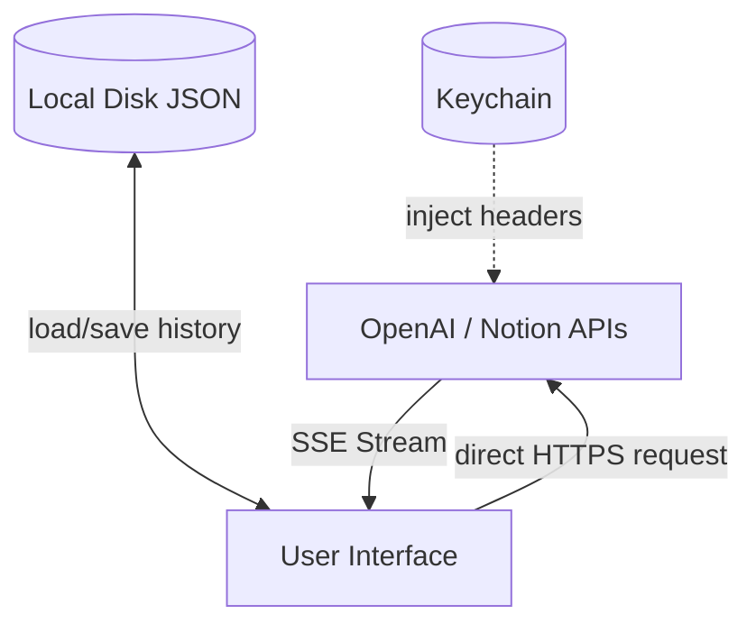

# OpenResponses

<p align="center">
  
</p>

<p align="center">
  <strong>SwiftUI developer client for the OpenAI Responses API and the successor to OpenAssistant.</strong>
</p>

<p align="center">
  <a href="https://apps.apple.com/us/app/openresponses/id6757338355">
    
  </a>
  
  
  
</p>

## Version 2.6 documentation

The [complete v2.5 → v2.6 release dossier](docs/releases/v2.6/README.md) covers the full source comparison, [What’s New](docs/ReleaseNotes_2.6.0.md), [changelog](CHANGELOG.md), technical behavior, upgrade steps, validation, and store/reviewer copy. Its [129-file inventory](docs/releases/v2.6/SourceInventory.md) includes committed work and the September implementation changes.

**App Store, checked September 8 (evening Pacific):** version 2.6 is live. App Store Connect reports 2.6 `READY_FOR_SALE` with build **41**, the Xcode Cloud run 41 archive of commit `5b270d8`, uploaded 12:14 Pacific; the public store lookup carries a release timestamp of 2026-09-09T01:59:47Z (18:59 Pacific). Build 41 is the completed 2.6 source plus the CI-only change in `5b270d8`; local build 39 was the same app source. The ASC snapshot below/linked predates the release.

## Overview

OpenResponses is a native SwiftUI Playground for OpenAI Responses API. It functions as a mobile developer playground and testing workspace, exposing low-level model parameters, tool execution, token-level streaming data, and raw request visibility without hiding the API behind a custom proxy layer.

* **Target Audience:** AI engineers, prompt designers, and developers needing direct client-to-API control.
* **Core Problem Solved:** Lack of visibility in standard AI interfaces. OpenResponses exposes raw token counters, network statuses, expandable reasoning summaries for supported reasoning models, and outbound/inbound JSON payloads.
* **Technical Characteristics:** Direct client-to-endpoint connections, local document parsing (with Vision OCR), and sandboxed browser automation loops.
* **Feature Tiers:** 
  * **Core Playground**: Responses API (Chat, Tool Calling, Vision, Models)
  * **Developer Lab**: Batch API, Fine-Tuning
  * **Legacy Migration**: retained Assistant JSON imports
* **Product Lineage:** OpenResponses is the active evolution of Gunnar Hostetler's API-tooling work and supersedes the older OpenAssistant Assistants API client.

---

## Product Snapshot

| Dimension | Detail |
|---|---|
| Platform | iOS / iPadOS / macOS Catalyst |
| Language | Swift |
| UI | SwiftUI |
| Architecture | MVVM-S |
| Primary APIs | OpenAI Responses API, Notion API, EventKit, Contacts |
| Storage | Keychain, sandboxed JSON files |
| App Store | [Download](https://apps.apple.com/us/app/openresponses/id6757338355) |
| Status | Active |
| License | [MIT](LICENSE) |

---

## Key Capabilities

* **Direct API Connections:** Outbound HTTPS traffic routes directly from the iOS client to OpenAI and Notion endpoints without intermediate proxy servers.
* **Asynchronous SSE Streaming:** Uses Swift Concurrency (`AsyncThrowingStream`) to parse Server-Sent Events line-by-line, dispatching UI updates to the `@MainActor` to avoid layout race conditions.
* **Realtime Voice WebSockets:** Includes Voice Mode using `wss://` for bi-directional 24kHz PCM16 audio streaming (Direct BYOK WebSocket mode).
* **Retained Assistant Exports:** Import saved Assistant JSON and convert it to Responses presets. The Assistants API shut down on August 26, 2026.
* **Developer Labs:** Batch job management with complete output/error exports, plus reviewed text-chat JSONL import and validation for eligible fine-tuning accounts. Current-chat export produces a draft dataset example.
* **Secure Keychain Storage:** API keys, Notion tokens, and custom Model Context Protocol (MCP) headers are stored inside the secure iOS Keychain. Request inspection/logging includes targeted credential redaction; keys are transmitted to the relevant service when needed for authentication.
* **On-device Browser Automation:** Persistent WKWebView with serialized DOM and screenshot actions, precise element references, cancellation, deadlines, and per-turn limits. Pending computer safety checks pause both tool paths. See [browser execution](docs/browser-execution.md).
* **Local Ingestion & OCR:** Extracts text from PDFs using `PDFKit` and recognizes text in image attachments using the native `Vision` OCR framework locally on-device.
* **Observability Tools:** Includes inline collapsible reasoning panels, live connection monitors, and a Request Inspector rendering raw JSON payloads.

---

## How It Works

The following flowchart outlines the request lifecycle, tool branches, and approval gates:


```mermaid
flowchart TD
    A[Compose request] --> B[Send to Responses API]
    B --> C[Read response events]
    C --> D{Execution owner}
    D -->|Hosted tools| E[OpenAI executes configured tools] --> C
    D -->|Client tool| F[Check enabled handler and execution rules]
    F --> G[Execute and return actual result] --> B
    D -->|Computer safety check| S[Pause for turn-scoped user decision]
    S -->|Allow| G
    S -->|Deny| X[Cancel pending work]
    D -->|Completed| H[Render answer, summaries and artifacts]
```

---

## Architecture

The codebase separates views from network and system frameworks using the MVVM-S pattern:


```mermaid
flowchart LR
    View[SwiftUI Views] <--->|Observe state| VM[ChatViewModel]
    VM <--->|Request completions| Services[Response runners / OpenAIService / ComputerService]
    Services -.->|Authenticate| Keychain[iOS Keychain]
    Services <--->|API Payload| OpenAI[OpenAI Responses API]
```

*For a detailed layer-by-layer system map and data flow boundaries, see [ARCHITECTURE.md](ARCHITECTURE.md).*

---

## Core Workflows

The local file conversion and ingestion workflow converts attachments prior to payload transmission:


```mermaid
flowchart TD
    A[Select file attachment] --> B[FileConverterService evaluates extension]
    B --> C{Format?}
    C -->|PDF| D[PDFKit extracts text] --> G[Pack into prompt payload]
    C -->|Image| E[Vision OCR recognizes text] --> G
    C -->|Text| F[Read raw content] --> G
    G --> H[Transmit request payload to OpenAI]
```

---

## Data Flow

Data boundaries separate on-device storage, Keychain secrets, and third-party APIs:


```mermaid
flowchart TD
    Keychain[(Keychain)] -.->|inject headers| API
    Disk[(Local Disk JSON)] <--->|load/save history| UI[User Interface]
    UI -->|direct HTTPS request| API[OpenAI / Notion APIs]
    API -->|SSE Stream| UI
```

---

## File Entry Points

| Concern | Files | Responsibility |
| :--- | :--- | :--- |
| **App Entry** | [OpenResponsesApp.swift](OpenResponses/App/OpenResponsesApp.swift) | Initial bootstrapping and startup migrations. |
| **DI Container** | [AppContainer.swift](OpenResponses/App/AppContainer.swift) | Service locator for dependency injection. |
| **Main UI** | [ContentView.swift](OpenResponses/App/ContentView.swift) | Navigation shell and tab container. |
| **Chat View** | [ChatView.swift](OpenResponses/Features/Chat/Views/ChatView.swift) | Chat rendering and text/attachment inputs. |
| **Chat ViewModel** | [ChatViewModel.swift](OpenResponses/Features/Chat/ViewModels/ChatViewModel.swift) | Session state management, settings, and tool approvals. |
| **OpenAI Client** | [OpenAIService.swift](OpenResponses/Core/Services/OpenAIService.swift) | Payload assembly and SSE stream parsing. |
| **Keychain Storage** | [KeychainService.swift](OpenResponses/Core/Services/KeychainService.swift) | Secure credentials management. |
| **Browser Automation** | [ComputerService.swift](OpenResponses/Core/Services/ComputerService.swift) | Sandboxed browser automation and capture loops. |
| **File Extraction** | [FileConverterService.swift](OpenResponses/Core/Services/FileConverterService.swift) | On-device file conversions and OCR text recognition. |
| **Notion Client** | [NotionService.swift](OpenResponses/Core/Services/NotionService.swift) | Direct Notion workspace database integrations. |

---

## Configuration

The configurations map to `UserDefaults` (for preferences) or the secure Keychain (for keys).

| Setting | Storage | Default | Required | Purpose |
| :--- | :--- | :--- | :--- | :--- |
| **OpenAI API Key** | Keychain (`openAIKey`) | None | **Yes** | Authenticates all OpenAI network requests. |
| **Notion Token** | Keychain (`notionApiKey`) | None | No | Authenticates Notion integration requests. |
| **Model Selection** | `UserDefaults` | `gpt-6-astra` | **Yes** | Responses model; Astra, Sol, Terra, and Luna are available in the current catalog. |
| **Reasoning Effort** | `UserDefaults` | `medium` | No | Configures model-aware effort choices; current models also expose higher efforts where supported. |
| **Web Search** | `UserDefaults` | `true` | No | Toggles OpenAI web search capabilities. |
| **Code Interpreter** | `UserDefaults` | `true` | No | Toggles OpenAI sandboxed Python containers. |
| **Computer Use** | `UserDefaults` | `false` | No | Toggles local browser automation tool. |
| **Notion Integration** | `UserDefaults` | `true` | No | Toggles Notion tool access. |
| **Apple Integrations** | `UserDefaults` | `true` | No | Toggles Calendar, Reminders, and Contacts access. |

---

## September 2026 API refresh

The playground now includes a shared current-model catalog, Astra-compatible reasoning controls, GPT Image 2, current Realtime transcription and voices, opt-in automatic compaction, persisted reasoning, pro reasoning, hosted shell, and deferred function/MCP loading through tool search. Saved presets and earlier supported models remain usable.

Native chat now executes configured function/custom tools, Astra async lookups, programmatic tool calls, and multi-agent responses. Multi-agent uses WebSocket result injection so waiting agents can resume immediately. Read-only calls can overlap; writes run sequentially. Root answers, subagent activity, tool results, and image previews appear in the chat. Interrupted turns preserve known results and mark uncertain outcomes without automatically retrying writes. MCP configuration is available again. These orchestration features apply to current-model foreground requests with Computer Use disabled.

**Settings → Model → API Workbench** exposes editable requests over HTTP, SSE, and persistent Responses WebSockets. It includes steering, tool-result batches and live injection, full response export, input token counting, standalone compaction, response retrieval/cancellation/input items, and conversation retrieval/items. Examples cover asynchronous functions, custom text tools, programmatic tool calling, hosted shell, image generation, apply patch, and the multi-agent beta. Workbench client tools use actual results supplied by the user; native chat executes its configured tools.

Manual chat compaction preserves the complete returned output window, including opaque items, then replays it on the next turn. It never treats a compaction ID as a response ID. The workbench displays unknown events and exports the complete final response; its on-screen event preview is bounded.

Current API contracts and verification details are recorded in [API refresh notes](docs/api-refresh-2026-09.md). These are source/build capabilities, not an App Store deployment claim.

**Settings coverage:** The shared `ResponseSettingsRegistry` and modern response controls expose saved prompt settings. Request mapping is model-aware: verbosity/reasoning use nested API fields, unsupported sampling is omitted, and preset names remain local metadata. See the [technical settings table](docs/releases/v2.6/TechnicalChanges.md) for current defaults and execution constraints.

---

## Build & Run

### Local Setup
1. **Clone the Repository:**
   ```bash
   git clone https://github.com/Gunnarguy/OpenResponses.git
   cd OpenResponses
   ```

2. **Open in Xcode:**
   ```bash
   open OpenResponses.xcodeproj
   ```

3. **Requirements:**
   * Xcode 16.1 or newer.
   * iOS 17.0+ deployment target.
   * Active OpenAI API key.

4. **Xcode Scheme Variables:**
   Under Xcode `Product > Scheme > Edit Scheme... > Arguments`, add:
   - `OPENAI_API_KEY`: API credential.
   - `NOTION_API_KEY`: Notion token (optional).

---

## Testing

| Test Type | Command / Procedure | Expected Result |
| :--- | :--- | :--- |
| **Build Target** | Build project in Xcode (`Cmd+B`) | Compilation completes with no errors. |
| **Unit/integration tests** | Use an available simulator and the command in the [validation ledger](docs/releases/v2.6/Validation.md). | Latest implementation run: 294 tests, zero failures. |
| **Secret Scan** | `python3 scripts/secret_scan.py` | CLI tool returns success with no keys detected. |
| **Preflight check** | `bash scripts/preflight_check.sh` | Confirms Info.plist privacy descriptions are present. |

---

## Privacy & Security

OpenResponses operates under a local-first threat model:
* **Network boundaries:** The device contacts configured API providers over HTTPS or secure WebSockets. Hosted tools, including MCP, may contact their configured services from OpenAI infrastructure.
* **Keychain Storage:** Storing API keys securely in the iOS Keychain.
* **Opt-In Safety Notice:** Requires explicit user confirmation prior to sending the first completions payload.

For details, refer to [SECURITY.md](SECURITY.md) and [PRIVACY.md](PRIVACY.md).

---

## Documentation

| Document | Purpose |
|---|---|
| [2.6 release dossier](docs/releases/v2.6/README.md) | Complete release documentation and evidence index |
| [Changelog](CHANGELOG.md) | Detailed categorized 2.5 → 2.6 changes |
| [Architecture](ARCHITECTURE.md) | System design, data flow, and service boundaries |
| [Security](SECURITY.md) | Secret handling, local storage, and release checks |
| [Privacy](PRIVACY.md) | Data storage, API transmission, and user controls |
| [Roadmap](ROADMAP.md) | Current status, planned work, and known gaps |
| [App Store Notes](APP_STORE.md) | App Store metadata, review notes, and release checklist |
| [Case Study](docs/CASE_STUDY.md) | Engineering retrospective and implementation notes |
| [Contributing](CONTRIBUTING.md) | Local development setup and contribution guidelines |
| [Release Notes (v2.6.0)](docs/ReleaseNotes_2.6.0.md) | Summary of changes, fixes, and updates in version 2.6.0 |

---

## Roadmap

The completed 2.6 source includes current-model native orchestration, Workbench, voice recovery, hosted MCP discovery, browser/search hardening, full job exports and persistence fixes. Remaining work includes release-candidate distribution, broader physical voice/accessibility/device checks, private MCP OAuth coverage and account-dependent service validation. See the [current roadmap](ROADMAP.md) and [release plan](docs/AppStoreReleasePlan.md).

---

## License

OpenResponses is released under the [MIT License](LICENSE).
