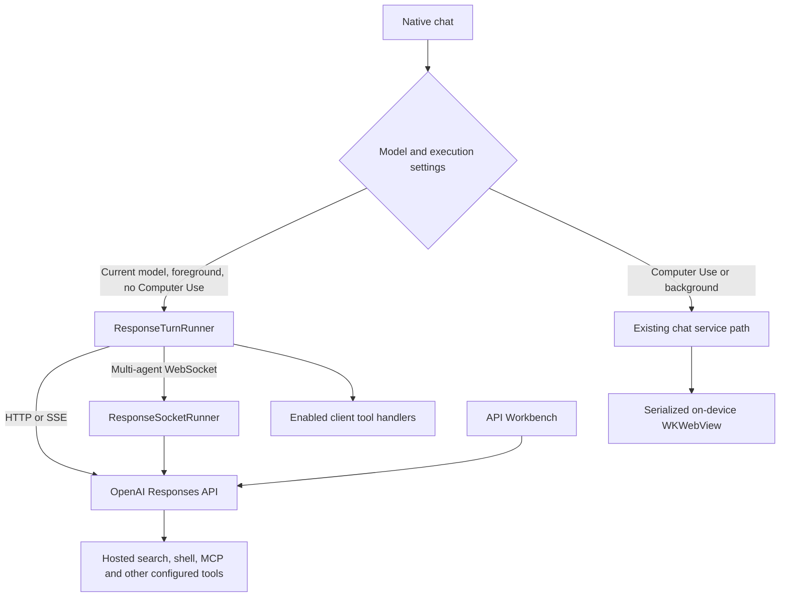

# OpenResponses 2.6: technical change record

**Source snapshot:** September 8, 2026. **Comparison:** last 2.5 source state (`855ab3b`) → current 2.6/build 39 working tree. See the [release dossier](README.md) for revision and tag boundaries, and [source inventory](SourceInventory.md) for every implementation file in scope.

This record distinguishes native app behavior from raw API access and server-hosted execution. A setting or request template does not guarantee that every account or model can use its corresponding API feature.

## 1. Models and request construction

[CurrentModelCatalog.swift](../../../OpenResponses/Core/Models/CurrentModelCatalog.swift) centralizes the current model IDs used by model selection, onboarding, chat status, compatibility checks, image generation, and voice. The recommended chat group is `gpt-6-astra`, `gpt-5.6-sol`, `gpt-5.6-terra`, and `gpt-5.6-luna`; the default is Astra. Image and voice defaults are `gpt-image-2`, `gpt-realtime-2.1`, and `gpt-live-transcribe`. Earlier model choices remain separate from the recommended group; retired identifiers are not presented as current recommendations.

This extends the earlier July GPT-5.6 integration. It also removes drift between independently maintained model menus. Family recognition normalizes case and surrounding whitespace and accepts supported dated-snapshot shapes, rather than accepting any arbitrary string that happens to start with a model name.

Existing prompt-cache controls remain optional, with cached-token and cache-write-token reporting preserved. No blanket cache-write configuration is added to short or variable prompts; caching work is only useful when a reusable prefix reaches the relevant threshold.

Request construction now applies model-specific compatibility. Astra offers low/medium/high/xhigh/max reasoning; the current GPT-5.6 group also offers none. Pro reasoning is restricted to supported Astra/Sol configurations. Unsupported Astra sampling fields are omitted, verbosity is nested under `text`, and reasoning controls remain consistent on follow-up requests. Displayed reasoning summaries are API-provided summaries, not access to hidden chain of thought.

[ModernResponseSettings.swift](../../../OpenResponses/Features/Settings/Views/ModernResponseSettings.swift) exposes advanced controls. Existing presets decode missing modern options with defaults rather than becoming unreadable.

| Option | Default / important behavior |
| --- | --- |
| Automatic compaction | Off; configured threshold defaults to 100,000 tokens. |
| Reasoning mode / context | Standard mode; automatic context selection. |
| Tool search / hosted shell | Off until enabled. |
| Custom tools | Function format by default; custom text format supported. |
| Image action / partial images | Automatic action; zero partial images requested by default. |
| Async / programmatic calling | Both off; mutually exclusive execution modes. |
| Multi-agent | Off; default maximum subagents is 3. |
| Client tool rounds | Default 12; HTTP runner clamps configured rounds to 1–32 and caps one response at 64 client calls. These are client execution limits, not a universal hosted-agent cost budget. |

The older unified response-settings registry and expanded settings UI are also part of the 2.5→2.6 development cycle. Credentials and saved model choices are preserved; a catalog refresh does not replace the user's existing API key or automatically grant new model access.

## 2. Execution paths and API surface

The current app has more than one response path. Current-model foreground chat uses the new runner when Computer Use and background mode are off. Computer Use and background requests retain their existing chat orchestration path. The API Workbench is an independent developer surface.

The main new boundaries are [ResponsesAPIClient.swift](../../../OpenResponses/Core/Services/ResponsesAPIClient.swift), [ResponseTurnRunner.swift](../../../OpenResponses/Core/Services/ResponseTurnRunner.swift), [ResponseSocketRunner.swift](../../../OpenResponses/Core/Services/ResponseSocketRunner.swift), and [APIWorkbenchSession.swift](../../../OpenResponses/Core/Services/APIWorkbenchSession.swift).

| API / operation | App exposure in the current implementation |
| --- | --- |
| `POST /v1/responses` | Native chat and editable Workbench requests; HTTP, SSE, and appropriate WebSocket execution. |
| Response retrieval and input items | Workbench retrieval and complete paginated input-item inspection; used by history/compaction flows where relevant. |
| Response cancellation | Background cancellation is explicit; closing a socket alone does not cancel a stored background job. |
| `POST /v1/responses/input_tokens` | Workbench input-token counting. |
| `POST /v1/responses/compact` | Standalone Workbench compaction and native context-management integration. |
| Conversations and their items | Create/retrieve known conversations, metadata and paginated items. No app-wide remote history enumeration claim. |
| Realtime WebSocket | Native voice session with current audio configuration and event handling. |
| Files and vector-store files | Upload, list, inspect and attach workflows; bounded indexing-readiness polling. |
| Batch jobs | Creation/listing and full output/error-file download where available. |
| Fine-tuning jobs | Reviewed text-chat JSONL import, parameter validation and job operations, subject to account availability. |
| Legacy Assistants | Local JSON migration remains; retired live operations are disabled. |

## 3. Client tools and multi-agent responses

Native tools use a request-time allowlist and check enabled tools again before execution. Read-only lookups may run in a bounded group of four; mutation handlers remain serial. Mutating tools are excluded from the programmatic/async paths that cannot safely promise the same execution semantics. Async multi-agent configuration disables parallel tool calls where required by the implemented protocol.

Configured function tools and custom text tools can reach existing local, webhook, Apple, and Notion handlers. Built-in echo/calculator examples are locally executable. Merely adding a shell, patch, or arbitrary tool schema to a raw Workbench request does not turn the iPhone into an unrestricted shell or code executor.

Multi-agent requests use the relevant beta header and omit incompatible fields such as unsupported reasoning-summary or `max_tool_calls` combinations. The socket runner sends results with `response.inject`, waits for acknowledgements and terminal state, and preserves caller/agent metadata. Root assistant text is kept distinct from child-agent activity in the presentation layer.

Recovery state retains known tool results and opaque response records. Cancelling after a possibly completed mutation does not automatically repeat it. Unknown outcomes require inspection before an explicit retry. Tool-call batches also now register the expected set before allowing a fast nonstreaming result to resume the response, fixing a race where the first tool could be submitted before the second call was registered.

## 4. API Workbench

September 8 adds a debounced, atomic Keychain draft store for request text, template, endpoint, transport and resource ID. Invalid drafts are recoverable, failed reads/writes preserve earlier data, and request export is always available. Replacing edited text requires confirmation. A native JSON editor disables smart punctuation. Structured schemas, root types and strict nested-object requirements are validated before all transports. Raw Workbench payloads do not automatically inherit account-library credentials.

The Workbench is accessible from **Settings → Model → API Workbench**. It provides editable JSON requests, transport selection, request/response inspection, templates, complete final-response export, token counting, standalone compaction, background retrieval/cancellation, and known-conversation operations.

Templates cover Astra, hosted shell, tool search, async and programmatic calling, multi-agent requests, image generation, automatic compaction, configuration updates, custom text tools, and apply-patch schemas. Template coverage is a convenient starting point, not proof of account availability or a local handler for every schema.

When the API returns a client tool call, the user can supply actual output using its real call ID and continue or inject the result. Unknown JSON fields remain intact. On-screen previews are bounded for responsiveness, while the full completed payload remains available for export. Steering handles acceptance/failure and the relationship between the original response's terminal event and a successor response. Reconnecting a socket does not automatically reconstruct an arbitrary in-flight Workbench session.

Offline Demo Mode and the first-live-send consent flow still apply. Those safeguards existed before this release and are preserved.

## 5. Realtime voice and dictation

Realtime voice and recorder surfaces were added during the 2.6 development cycle, then hardened in September. The current session payload uses nested audio configuration and 24 kHz PCM16 input. Microphone audio is converted from the actual capture format through `AVAudioConverter`; it is not blindly relabeled as the expected sample rate.

[RealtimeAudioPipeline.swift](../../../OpenResponses/Core/Services/RealtimeAudioPipeline.swift) separates conversion and playback-state helpers. Playback scheduling/completion ownership stays on the main actor. Session generations reject stale callbacks, and elapsed-playback recovery prevents the speaking indicator from remaining stuck after output completes.

Microphone transmission is no longer blocked merely because the assistant is marked as speaking. This supports continued conversation and VAD-driven interruption. Mute keeps the session established. The visualizer reflects capture/playback levels, and route changes and audio interruptions have recovery handling. Audio-session configuration precedes engine setup.

Recorded two-turn synthetic VAD validation passed. That does not establish flawless echo cancellation, Bluetooth routing, lock-screen behavior, or acoustic interruption on every physical device; these remain manual release checks.

## 6. MCP accounts, discovery, credentials and transport

The September 8 account redesign is documented completely in [MCP connections](../../mcp-connections.md). It replaces token-pasting setup with native provider sign-in, a shared account library, per-chat multi-account selection, atomic OAuth storage/refresh and a 44-entry catalog plus live registry search. Provider registration requirements are explicit. The existing headless discovery engine described below remains in use.

MCP discovery is **OpenAI-hosted** through a Responses request. The iPhone configures the server, credentials and allowed tools; OpenAI connects to the remote MCP endpoint. It is not a local MCP subprocess and does not launch a browser to discover tools. Browser automation is a separate on-device WebKit feature.

[MCPDiscoveryService.swift](../../../OpenResponses/Core/Services/MCPDiscoveryService.swift) replaces the old pre-chat discovery/health gate. Normal chat no longer requires a preliminary model turn or a label-only 24-hour health result. Explicit discovery advertises only the configured MCP tool, uses fixed discovery instructions with `tool_choice: none`, and processes `mcp_list_tools`. An empty tool catalog is a valid result. Unexpected tool execution or approval events fail discovery rather than granting permission.

| Discovery property | Bound |
| --- | --- |
| Total deadline | 35 seconds, including one eligible availability retry. |
| Retry policy | No blind retry for authorization, rate-limit or malformed-response failures. |
| Cache | In-memory, 5 minutes, at most 16 entries; keyed by connection, label, credentials, allowed tools and OpenAI account identity. |
| Concurrency | Identical requests coalesce; cancellation of the final consumer closes the request. |
| Stream parser | SSE comments, CRLF, multiline data and `[DONE]`; 4 MiB event / 12 MiB stream / 64 buffered events / 2,000 tools. |
| HTTP session | Ephemeral; no cookie/cache persistence and no redirects. |

Refreshing invalidates cached state first. Discovery drafts do not write or migrate Keychain entries. Explicitly empty credential overrides remain empty. API-key headers and bearer authorization have distinct mappings; malformed or duplicate headers are rejected. Saving uses the active prompt/server identity rather than accidentally preserving a temporary draft identity.

The UI distinguishes configured from verified connections and shows tools, schemas, annotations, filtering and last-check state. Cache success is not permanent authorization. Private OAuth servers remain dependent on their own authentication setup and were not exhaustively validated by the public-server probe. See the detailed [MCP implementation notes](../../mcp-discovery.md).

## 7. Browser execution and hosted web search

Computer Use and DOM tools share a serialized execution lane around a persistent, offscreen **WKWebView on the iPhone**. It uses the app's WebKit website store, not Safari's tabs or a remote browser. [BrowserExecution.swift](../../../OpenResponses/Core/Services/BrowserExecution.swift) owns scheduling and cancellation; [BrowserDOM.swift](../../../OpenResponses/Core/Services/BrowserDOM.swift) supplies structured page operations.

The browser now tracks navigation identity and callback completion, rejects stale generations, cancels queued/active work on Stop or chat changes, and rebuilds after a WebKit-process failure without replaying the action. Attempted call IDs are remembered in a bounded 2,048-entry in-memory set, including uncertain outcomes, to reduce duplicate side effects across turns.

Hard budgets are 80 actions and 20 distinct main-frame URLs per user turn. Redirects count; fragment-only changes do not. Navigation has a 20-second bound; JavaScript and screenshots have 6 seconds; an operation has 45 seconds and queue admission has 120 seconds. URL validation permits HTTP(S), rejects embedded credentials, routes new windows into the controlled view, and reports nondisplayable downloads explicitly.

Computer screenshots contain real PNG pixels at the advertised 440×956 size. The old 3× device-pixel mismatch is fixed; a failed capture is an error, not a diagnostic image masquerading as a page screenshot.

DOM operations include navigation, reading, search, click, type, scroll, back/forward and reload. Element refs live in an isolated content world and expire when the snapshot, URL, element or form action changes. A target must be unique, visible and unobscured. Input uses native setters/events and verifies the resulting value; submissions avoid accidental repeated clicks. Readiness waits for usable DOM plus two animation frames within a deadline.

API-provided safety approvals are scoped to the initiating turn. Denial/dismissal cancels pending work. This does not mean every click has a separate confirmation, or that the app implements an additional independent safety classifier. Cancellation cannot undo a mutation already received by a website.

Cross-origin frames, closed shadow roots, trusted native events, CAPTCHAs and some authentication/file pickers remain limits. Hosted web search separately uses corrected domain, context and approximate-location fields and exposes citations/source records. Search-depth/page guidance in instructions is not equivalent to the browser's enforced action limits. See [browser execution notes](../../browser-execution.md).

## 8. Conversations, context and persistence

Compaction retains the complete returned context output rather than only visible text. Manual compaction gathers complete input/output, treats compaction IDs separately from response IDs, replays compacted context once, and guards against a late result being applied after a chat switch. Multi-agent sessions use their supported server compaction path. Opaque program fingerprints, reasoning/context records and agent metadata survive the continuation path where needed.

The remote browser operates on conversation IDs known from local history. Metadata and item hydration are distinct paginated operations. It does not claim an account-wide listing endpoint or cloud-sync completeness for conversations unknown to the device. Deleting/editing messages invalidates the corresponding raw/remote continuation path rather than silently continuing an incompatible branch.

App startup supplies one root `ChatViewModel`. Streaming buffers carry conversation and generation identity; switching chats cancels/flushes the previous owner before selection changes. Deleting an active conversation cancels pending work before file deletion so a delayed save cannot resurrect it.

[ConversationStorageService.swift](../../../OpenResponses/Core/Services/ConversationStorageService.swift) coalesces saves with a 750 ms non-starving checkpoint and serial background encoding/atomic writes. Immutable conversation snapshots and locked, invalidatable image-encoding caches reduce repeated work. Terminal responses and background lifecycle transitions flush state. Save errors are shown without recursively adding another chat message that triggers another save.

Existing conversation JSON remains compatible. Four pre-existing physical-device conversation files were unchanged after the installed build relaunched; this is a bounded migration/preservation check, not an exhaustive recovery test for every possible stored file.

## 9. Files, datasets and jobs

Vector-store upload completion and search readiness are separate states. [VectorStoreIndexing.swift](../../../OpenResponses/Core/Services/VectorStoreIndexing.swift) waits for terminal indexing success, reports failed/cancelled results and last errors, and bounds polling to 90 seconds with two-second intervals and per-request timeouts. Stopping the local wait does not cancel server indexing. “Check again” polls the existing upload instead of duplicating it. Multi-file progress retains partial successes and failures; attachment state is explicit.

Batch output and error files download in full to a temporary file and use the system share/save sheet. Available partial files can be exported even when the overall job did not finish successfully. Download cancellation and share completion clean up temporary artifacts. A transport fixture verified preservation of 10,000 lines and roughly 500 kB, rather than only a truncated preview.

Fine-tuning now imports reviewed UTF-8 text-chat JSONL. The device-side validation limit is 50 MB; every line must be an object with valid system/user/assistant text messages, a user turn and final assistant turn, and the dataset must contain at least ten examples. This is deliberately a text-chat validator, not a claim to support all possible training formats. Image/tool-call training records are not accepted by this import path.

Exporting the current chat creates a draft with app system-log messages excluded. One exported conversation is not automatically a training-ready dataset. Epoch/batch values must be positive integers or automatic; learning-rate multiplier must be positive and finite or automatic. Model/parameters are snapshotted at submission and duplicate submissions are disabled. The UI explains the fine-tuning availability wind-down; server/account eligibility remains authoritative.

[ResourcePagination.swift](../../../OpenResponses/Core/Services/ResourcePagination.swift) collects supported lists with cancellation, overlapping-item deduplication, proper cursor query encoding, and explicit failure on missing/repeating cursors. Bounds are 1,000 pages of up to 100 items; a malformed or exhausted traversal is not silently presented as a complete partial list. It is used for vector-store files, Batch and fine-tuning jobs. Notion search separately honors bounded page sizes and real cursors while preserving whole-page results.

## 10. Earlier 2.6 work, privacy and maintenance

The full source interval also includes richer response artifacts and metadata/timelines, remote hydration, developer-lab screens, concurrent file work, settings coverage, and UIKit/Swift-concurrency repairs. Calendar, Reminders, Contacts and Notion integrations existed in 2.5; 2.6 improves their date utilities, actor/value boundaries and Notion pagination instead of introducing those integrations from scratch. Provider scaffolding does not establish a complete Gmail/Drive product feature.

Live retired Assistants operations are disabled, while local Assistant JSON migration into Responses presets remains available. Demo Mode, first-send consent and Keychain storage are retained behavior. The OpenAI key is sent to OpenAI for authentication. Requested messages, attachments and tool results leave the device for processing; optional remote storage and provider retention have separate semantics. Hosted MCP configuration can send its credentials to OpenAI so it can authenticate to the configured server. Documentation must not claim that all keys or all chat data never leave the device.

Request inspection and logging received targeted redaction work; this is not an audit proving that every legacy diagnostic surface can never contain sensitive content. Exported raw API payloads deserve the same care as their original conversation data.

The updated GitHub workflow runs `xcodebuild test` against an available iPhone simulator and uploads its result bundle. The latest local suite passed 294 tests; the edited workflow has not yet run in GitHub. Xcode Cloud/ASC records and local build evidence are documented separately in [validation](Validation.md) and the [release plan](../../AppStoreReleasePlan.md).
